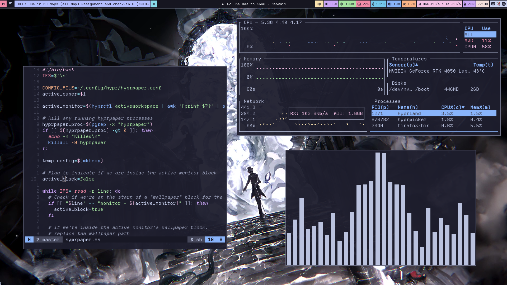

# What Is Ricing

Week 1. The customised desktop, taken seriously.

---

{/* _class: impact */}

## Race Inspired Cosmetic Enhancements

The term was an insult first, aimed at cheap body kits on cheaper cars. The
desktop borrowed it, kept the irony, and made it a badge.

---

## Three claims for the semester

- the desktop is a manifesto, not a preference
- the screenshot is the artefact, not the setup
- reproducibility is the discipline, not the decoration

---

## What r/unixporn actually shows

A gallery of desktops photographed to be seen. Not one of them was assembled to
get work done faster. Hold that thought until week 11.


---

## What you will make

One complete, original, reproducible setup. Built in the open, defended every
week, photographed at the end.

---

{/* _class: impact */}



# The rice is a portrait

We spend twelve weeks proving it.

---

## Before the lab

```sh
mise install
pnpm install
pnpm dev
```

Have a machine, real or virtual, that you are willing to break. Bring one
screenshot you admire and one sentence on why.
